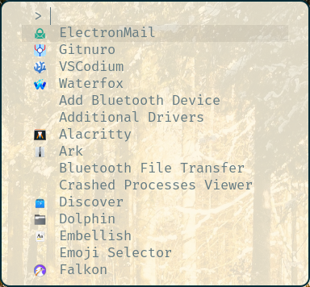
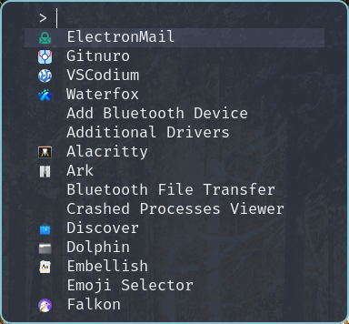

## What is Fuzzel?

Fuzzel is a run launcher similar to things like dmenu or rofi.

## Where can the full list of config options be found?

The full list of config options can be seen [here](https://manpages.ubuntu.com/manpages/lunar/man5/fuzzel.ini.5.html), among other places.

## What is your "themes" directory?

While fuzzel doesn't have support for theme files in the same way as other things (such as Alacritty), it does support colors in the fuzzel.ini file. To use my "theme files", just copy the contents and replace them into the fuzzel.ini file that is your config.

For example, you can take the default colors:

```ini
[colors]
background=fdf6e3dd
text=657b83ff
match=cb4b16ff
selection=eee8d5dd
selection-text=657b83ff
selection-match=cb4b16ff
border=002b36ff
```

and replace the whole block with the block from my themes/nord.ini file:

```ini
[colors]
background=2e3440f2
text=eceff4ff
match=81a1c1ff
selection=3b4252f2
selection-text=eceff4ff
selection-match=81a1c1ff
border=88c0d0ff
```

This results in the following change (left default, right nord):



